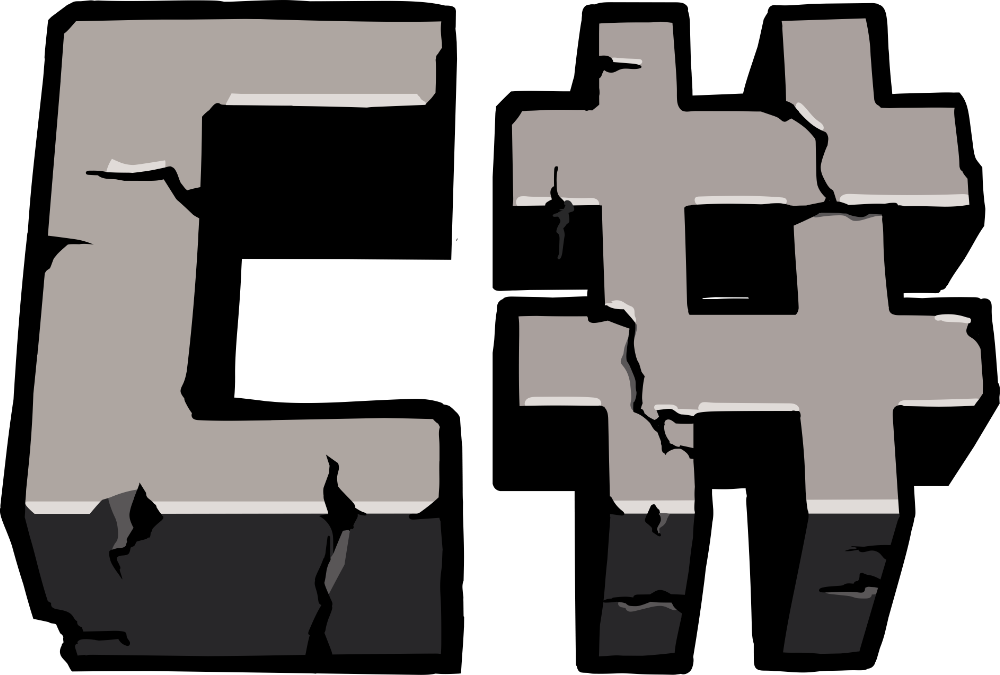

<p align="center">

<h1 align="center">OmniBlock</h1>
<p align="center">A heavily modified fork of <a href="https://git.gay/betasharp-official/betasharp">BetaSharp</a>.</p>
</p>
<p align="center">
<a href="https://discord.gg/x9AGsjnWv4"></a>


</p>


# Notice

> [!IMPORTANT]
> OmniBlock requires a legally purchased copy of Minecraft. We do not support or condone piracy. Please purchase Minecraft at [minecraft.net](https://www.minecraft.net).

## Fork of BetaSharp

OmniBlock is a **heavily modified fork** of [BetaSharp](https://git.gay/betasharp-official/betasharp), a C# recreation of Minecraft Beta 1.7.3.

It keeps Beta 1.7.3's *world* - the terrain a seed produces, and the saves on disk - and rebuilds everything around it. Where this fork departs from upstream:

- **Scripting-based modding** - content is authored, not compiled in: JSON assets plus TypeScript/JS mods running on Jint (a pure C# JavaScript engine). Mods ship as assets and scripts, not as forks of the engine.
- **A rebuilt network protocol** - UDP-based, versioned, extensible; replaces Beta 1.7.3's flat `PacketId : byte` wire protocol. Expected to be wire-incompatible with upstream.
- **WebGPU rendering** - the sole rendering backend (wgpu native, WGSL shaders).

World generation and save format stay 1:1 compatible with Beta 1.7.3.

## Running

The launcher is the recommended way to play, it authenticates with your Microsoft account and starts the client automatically. \
Clone the repository and run the following commands.

```
cd OmniBlock.Launcher
dotnet run --configuration Release
```

## Building

Clone the repository and make sure the .NET 10 SDK is installed. For installation, visit [dotnet.microsoft.com](https://dotnet.microsoft.com/en-us/download). \
The Website lists instructions for downloading the SDK on Windows, macOS and Linux.

It is recommended to build with `--configuration Release` for better performance. \
The server and client expect the JAR file to be in their running directory.

```
cd OmniBlock.(Launcher/Client/Server)
dotnet build
```

## Contributing

Contributions are welcome! Please read [CONTRIBUTING.md](CONTRIBUTING.md) for the code of conduct and pull request process. \
This is a personal project, so review and merge timelines aren't guaranteed, but submissions are appreciated.
