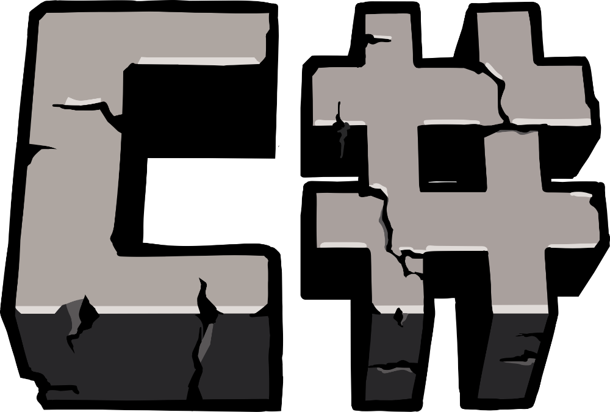

<p align="center">

<h1 align="center">OmniBlock</h1>
<p align="center">A heavily modified fork of <a href="https://git.gay/betasharp-official/betasharp">BetaSharp</a>.</p>
</p>
<p align="center">
<a href="https://discord.gg/x9AGsjnWv4"></a>


</p>


# Notice

> [!IMPORTANT]
> OmniBlock requires a legally purchased copy of Minecraft. We do not support or condone piracy. Please purchase Minecraft at [minecraft.net](https://www.minecraft.net).

## Fork of BetaSharp

OmniBlock is a **heavily modified fork** of [BetaSharp](https://git.gay/betasharp-official/betasharp), a C# recreation of Minecraft Beta 1.7.3.

It keeps Beta 1.7.3's *world* - the terrain a seed produces, and the saves on disk - and rebuilds everything around it. Where this fork departs from upstream:

- **Scripting-based modding** - content is authored, not compiled in: JSON assets plus mods running on Luau (Roblox's Lua dialect). Mods ship as assets and scripts, not as forks of the engine.
- **A rebuilt network protocol** - UDP-based, versioned, extensible; replaces Beta 1.7.3's flat `PacketId : byte` wire protocol. Expected to be wire-incompatible with upstream.
- **WebGPU rendering** - the sole rendering backend (wgpu native, WGSL shaders).

World generation and save format stay 1:1 compatible with Beta 1.7.3.

## Running

The launcher is the recommended way to play, it authenticates with your Microsoft account and starts the client automatically. \
Clone the repository and run the following commands.

```
cd OmniBlock.Launcher
dotnet run --configuration Release
```

## Building

Clone the repository and make sure the .NET 10 SDK is installed. For installation, visit [dotnet.microsoft.com](https://dotnet.microsoft.com/en-us/download). \
The Website lists instructions for downloading the SDK on Windows, macOS and Linux.

It is recommended to build with `--configuration Release` for better performance. \
The server and client expect the JAR file to be in their running directory.

```
cd OmniBlock.(Launcher/Client/Server)
dotnet build
```

### Native Luau build

`OmniBlock.Luau` builds the native runtime with CMake as part of `dotnet build`.
The resulting library is copied automatically into client, test, and publish outputs.
Initialize the pinned sources once with `git submodule update --init --recursive`.

Native builds require CMake 3.24 or newer and a C++17 toolchain. On Windows,
install Visual Studio Build Tools with **Desktop development with C++**, including
the MSVC compiler and Windows SDK. Clang alone does not supply the required headers
and libraries. On Linux, install CMake, a C++ compiler, and make or Ninja; on macOS,
install CMake and the Xcode command-line tools.

LLVM-MinGW is also supported on Windows. Add its `bin` directory and Ninja to
`PATH`, set `$env:CC='clang'; $env:CXX='clang++'` in PowerShell, and build with
`dotnet build -p:LuauCMakeGenerator=Ninja`. The native DLL links its C++ runtime
statically, so the packaged client does not require LLVM-MinGW runtime DLLs.

To select a CMake generator explicitly, use
`dotnet build -p:LuauCMakeGenerator="Visual Studio 17 2022"` or
`dotnet build -p:LuauCMakeGenerator=Ninja`.
Native build directories are separated by host runtime and .NET configuration.
CMake handles incremental compilation; rerunning `dotnet build` updates changed native sources.
When changing generators or installing a toolchain after a failed configuration,
remove the corresponding directory under `native/luau/build/msbuild` so CMake can
detect the new toolchain without reusing its previous cache.

For a supplied native library or cross-publishing, use
`-p:BuildLuauNative=false -p:LuauNativePath="absolute/path/to/library"`.
The supplied library must match the target platform, architecture, and pinned Luau ABI.
Missing prerequisites or native libraries fail the build rather than producing an
executable without its required scripting runtime.

## Contributing

Contributions are welcome! Please read [CONTRIBUTING.md](CONTRIBUTING.md) for the code of conduct and pull request process. \
This is a personal project, so review and merge timelines aren't guaranteed, but submissions are appreciated.

## License

OmniBlock's Covered Code is licensed under the [Common Public Attribution License 1.0](LICENSE.md). The required attribution URL is <https://github.com/tomast1337/omniblock>.

Code inherited from [BetaSharp](https://git.gay/betasharp-official/betasharp) remains available under its original MIT license. See [LICENSING.md](LICENSING.md) for scope and third-party licensing details.
